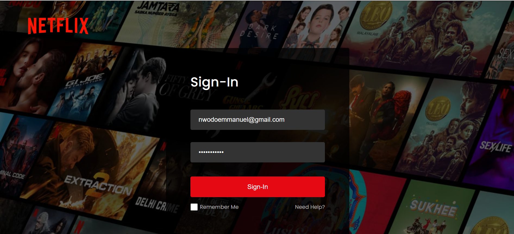
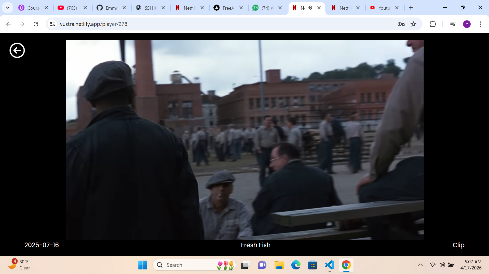

# 🎬 Netflix Clone

A responsive Netflix-inspired web application built with **React**, **Vite**, **Firebase Authentication**, **Firestore**, and **TMDB API**.
This project replicates core Netflix features such as user authentication, movie browsing, and trailer playback.

---

## 🚀 Features

* 🔐 User Authentication (Sign Up / Login / Logout) using Firebase
* 🏠 Dynamic homepage with movie categories
* ▶️ Movie trailer playback (YouTube embed via TMDB API)
* 🔄 Real-time authentication state handling
* 📱 Responsive design for desktop and mobile
* 🔔 Toast notifications for user feedback

---

## 🛠️ Tech Stack

* **Frontend:** React, Vite
* **Routing:** React Router DOM
* **Authentication & Database:** Firebase Auth, Firestore
* **API:** TMDB (The Movie Database)
* **UI Enhancements:** React Toastify

---

## 📂 Project Structure

```
src/
│── components/       # Reusable UI components (Navbar, Footer, etc.)
│── pages/            # Application pages (Home, Login, Player)
│── assets/           # Images and static files
│── firebase.js       # Firebase configuration and auth logic
│── App.jsx           # Main app routing
│── main.jsx          # Entry point
```

---

## ⚙️ Getting Started

### 1. Clone the repository

```bash
git clone <your-repo-url>
cd netflix-clone
```

---

### 2. Install dependencies

```bash
npm install
```

---

### 3. Create a `.env` file

In the root directory, create a `.env` file and add the following:

```env
VITE_FIREBASE_API_KEY=
VITE_FIREBASE_AUTH_DOMAIN=
VITE_FIREBASE_PROJECT_ID=
VITE_FIREBASE_STORAGE_BUCKET=
VITE_FIREBASE_MESSAGING_SENDER_ID=
VITE_FIREBASE_APP_ID=
VITE_TMDB_BEARER_TOKEN=
```

---

### 4. Run the development server

```bash
npm run dev
```

Then open:

```
http://localhost:5173
```

---

## 🔐 Environment Variables

This project requires API keys for:

* **Firebase** (Authentication + Firestore)
* **TMDB API** (Movie data & trailers)

⚠️ Note:
Do **not** commit your `.env` file to GitHub.
Use `.env.example` to show required variables.

---

## 📸 Screenshots

### Home Page


### Login Page


### Player Page


---

## 🧠 What I Learned

* Structuring a React application with reusable components
* Managing authentication state using Firebase
* Integrating third-party APIs (TMDB)
* Handling routing and navigation with React Router
* Improving UI/UX with loading states and notifications

---

## 🚧 Future Improvements

* 🔍 Add search functionality
* ❤️ Add watchlist / favorites feature
* 🔒 Implement protected routes
* ⚡ Improve loading states and error handling
* 🎨 Enhance UI animations and accessibility

---

## 🌐 Live Demo

[*(https://vustra.netlify.app)*]

---

## 📌 Acknowledgements

* TMDB API for movie data
* Firebase for authentication and backend services
* Netflix UI inspiration

---

## 👨‍💻 Author

Your Name
GitHub: https://github.com/EmmanuelNwodo/Netflix-clone

---

## ⭐️ Show your support

If you like this project, feel free to ⭐️ the repo!
